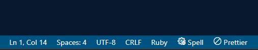
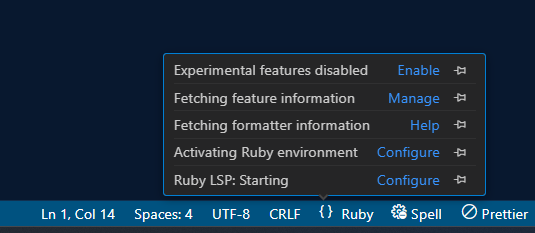
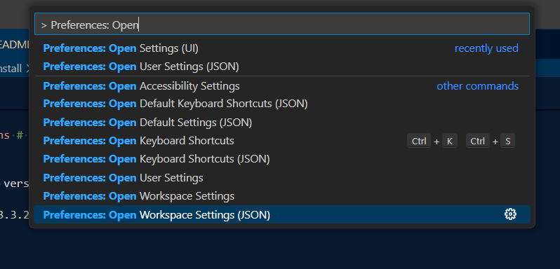

# rubyCoding
Implementation of [Advent of code](https://adventofcode.com/2021/) 2021 with ruby. It is interesting to have knowledge in language you don't mainly use. So I try to learn *ruby* with this challenge.

PS : Please don't judge my code :p


# Install


## Rbenv

### Windows (from https://github.com/ccmywish/rbenv-for-windows)

```sh
# Customize the location you want to install to,
# preferably without spaces, as it has not been tested
$env:RBENV_ROOT = "C:\Ruby-on-Windows"
iwr -useb "https://github.com/ccmywish/rbenv-for-windows/raw/main/tools/install.ps1" | iex
```

After install is complete launch this command:

```sh
& "$env:RBENV_ROOT\rbenv\bin\rbenv.ps1" init
```

The repository advice you to put these lines in your ```$profile``` file, to do so in windows:

```sh
# rbenv for Windows
$env:RBENV_ROOT = "C:\Ruby-on-Windows"

# Not easy to download on Github?
# Use a custom mirror!
# $env:RBENV_USE_MIRROR = "https://abc.com/abc-<version>"

& "$env:RBENV_ROOT\rbenv\bin\rbenv.ps1" init
```


### Unix (from https://github.com/rbenv/rbenv)


Simple as unix :

```sh
sudo apt install rbenv & rbenv init
```

If the installation is not the *latest version* of rbenv, do as follow : 

> Clone rbenv into ~/.rbenv.
```sh
git clone https://github.com/rbenv/rbenv.git ~/.rbenv
```

> Set up your shell to load rbenv.
```sh
~/.rbenv/bin/rbenv init
```


## Ruby

When _rbenv_ is installed, ruby version can be easily installed.

> Checks available ruby versions
```sh
rbenv install -l
```

> Install ruby version (here considering 3.3.2 as latest version of ruby)
```sh
rbenv install 3.3.2
```

> Use it locally (this should create .ruby-version file)
```sh
rbenv local 3.3.2
```

> Checks of the version installed
```sh
rbenv versions # Should output 3.3.2
```

> Apply this version to shell
```sh
rbenv shell 3.3.2 # Now taping 'ruby' in shell should works!
```


## Ruby In Vscode


Now that *ruby* is installed locally, we have to link it to our files. At first ruby file looks like this:



Here we don't have yet settings to our ruby file, we will use **[ruby Lsp](https://code.visualstudio.com/docs/languages/ruby)**
for this.

> Follow the instruction in order to install extension.
> 

Install it with ruby : 

```sh
gem install ruby-lsp
```

Once installed in vscode, this should looks like this : 



We Will need some settings in order to patch this :

> Open Them with this command in vscode:


Then, paste this line 

```json
"rubyLsp.rubyVersionManager": {
    "identifier": "rbenv"
}
```

## Rubocop


We need a linter and formatter for our files, **[Rubocop](https://github.com/rubocop/vscode-rubocop)** will
be used.

To install it launch :

```sh
gem install rubocop # this should  install about 10 gems
```

> Now install the vscode extension for _rubocop_.

execute command

```sh
bundle update
```


We should now have rbenv ruby version linked to rubyLsp:


------------------------------------------------